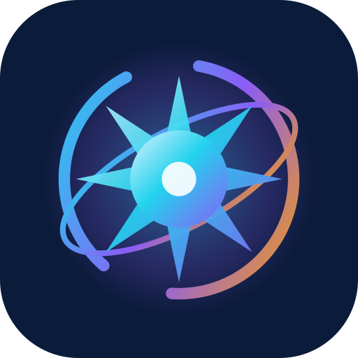
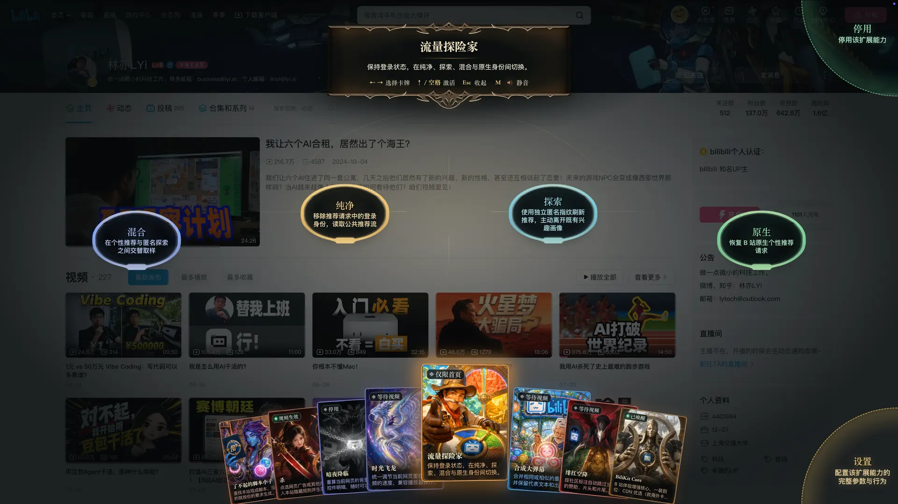
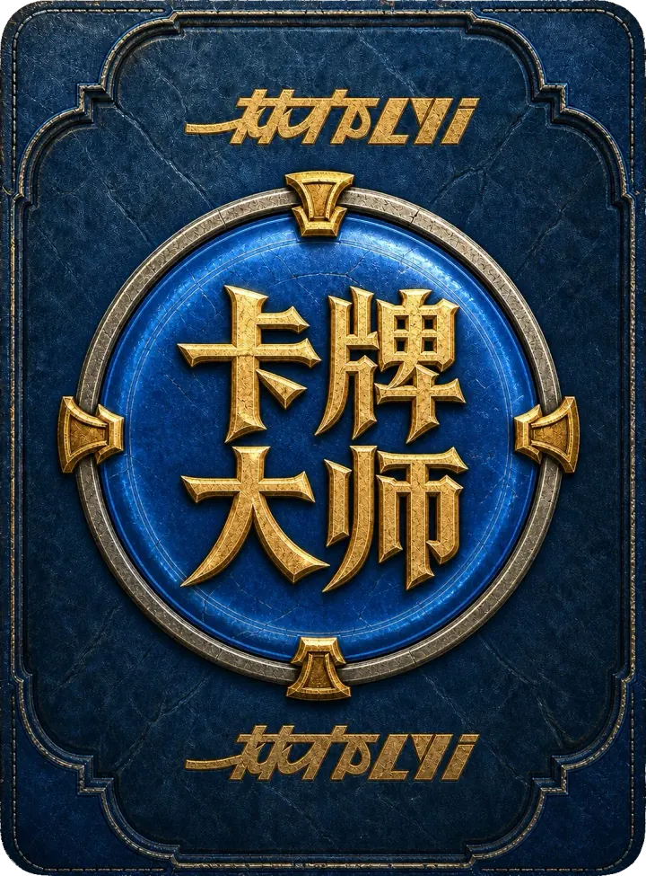

<div align="center">
  

  <h1>万象星核 · NovaBay</h1>

  <p><strong>一舱统御脚本、AI、视频与同步。</strong></p>
  <p>用户脚本 · AI 助手 · 内容过滤 · 深色主题 · 倍速播放 · 媒体资源 · WebDAV 同步</p>

  <p>
    <a href="https://github.com/LYiHub/Card-master-browser-extension-public/releases/latest">
      
    </a>
    <a href="./LICENSE">
      
    </a>
    
    
  </p>

  <p>
    <a href="https://github.com/LYiHub/Card-master-browser-extension-public/releases/latest"><strong>下载发布版</strong></a>
    ·
    <a href="https://github.com/LYiHub/Card-master-browser-extension-public/issues">问题反馈</a>
    ·
    <a href="https://blog.medicalstu.cn">XLL Studio</a>
    ·
    <a href="./THIRD_PARTY_NOTICES.md">第三方声明</a>
  </p>
</div>

## 视觉一览

<p align="center">
  
</p>

<p align="center">
  
  
  
  
</p>

<p align="center"><sub>卡背 · 内容过滤 · 倍速播放 · 脚本管理</sub></p>

## 核心能力

- 📜 **脚本管理** — 安装、导入、更新、启停、隐藏；新装默认启用
- ✨ **脚本工坊** — 用自然语言搜索、创建、解释、修复脚本；兼容 Responses 与 Chat Completions
- 🖼️ **新标签页** — 必应每日壁纸、快捷方式、书签与搜索
- 🚫 **内容过滤** — 点选隐藏广告或其他页面元素，支持订阅规则
- 🌙 **深色主题** — 重算页面明暗 · 新装默认停用
- ⏩ **倍速播放** — 统一调节网页音视频速度
- 📥 **媒体资源** — 发现并取得页面媒体 · *Chromium / Firefox*，新装默认停用
- 🎬 **视频增强** — 跳过片段、弹幕合并，以及 B 站 / YouTube SponsorBlock
- 🎮 **手柄控制** — 鼠标、键盘、手柄一套操作；含屏幕键盘、拼音和语音
- ☁️ **WebDAV 同步** — 在「设置 → 数据管理 → 跨设备同步」连接自己的服务，统一同步脚本、卡牌与插件配置，支持合并预览、冲突选择和历史恢复。
- 🗄️ **数据管理** — 本机备份导入导出、回收站、权限自检、失败留证、卡牌标签与按卡选择性同步

同一套核心代码打 Chromium、Firefox、Safari 三份包。扩展按 Manifest V3 规范构建，界面统一使用
HarmonyOS Sans 字体；音效默认静音，动效跟随系统的「减弱动态效果」设置。

## 全局设置：模型服务与同步

扩展自带全局设置页（点工具栏图标，或在牌阵里选「设置」）。在 **AI 服务** 一节填写自己的：

- **API 请求地址**：内置常用服务商预设，也可以填自建网关；
- **模型名称**：按填写的地址列出可用模型，或直接手输；
- **API Key**：只保存在本机扩展存储里，输入后以掩码显示。

填完点「测试连接」即可校验。脚本工坊、AI 助手和语音能力都走这一份配置。
在「数据管理 → 跨设备同步」勾选「同步包含密钥」后，请求地址、模型与 API Key
会随 WebDAV 配置一起同步到你自己的服务器，换设备登录即可直接使用。

## 数据与可靠性

这些入口都在「设置 → 数据管理」里，按“出事之前”和“出事之后”分开排列，全部只操作本机
或你自己的服务器，不经过任何第三方。

### 本机备份（导出 / 导入）

一次导出得到一个 JSON 文件，内容是全部卡牌与脚本、偏好设置，以及已填好的 WebDAV
地址与 AI 服务设置；换浏览器或重装扩展时导入同一个文件即可复原，不经过网络。

- 文件名形如 `novabay-backup-20260923-2030.json`，导出后请自行保管；
- 文件里带有 WebDAV 账号密码和接口密钥，只保存在自己的电脑上；
- 导入前先校验格式与体积：文件不超过 48 MB、内容不超过 64 MB、条目不超过 10,000 项，
  任何一项不合格都直接拒绝，本机数据不会被改动一半；
- 导入以备份内容为准：备份里没有的本机脚本会被记为删除，避免出现半新半旧的牌库；
  个别读不懂的条目会被跳过并在结果里列出名字。

### 回收站

删除卡牌不再立即销毁。卡牌连同脚本源码进入回收站，保留 30 天、最多 30 张，可以
放回牌库、彻底删除或一键清空。放回后启用状态、匹配范围与标签都按删除前的样子恢复。

### 权限与运行条件

脚本没跑起来时先做一次自检，四项各给「正常 / 需要注意 / 已失效」和一句人话说明：

| 检查项 | 看的是什么 |
| --- | --- |
| 脚本执行能力 | 浏览器是否允许本扩展注入用户脚本（Chromium 要在扩展详情页打开开关） |
| 当前站点授权 | 这张卡牌的匹配地址是否被排除、未授权或临时撤销 |
| 卡牌运行状态 | 最近有没有卡牌抛错，列出卡牌名与错误摘要 |
| 扩展存储 | 本机存储是否被写满或被策略禁用 |

结果可以一键复制成纯文本，求助时不必截图。入口被关掉导致自检读不到时，面板只会说明
读不到，不会把责任推给脚本。

### 脚本失败留证

卡牌抛错的瞬间自动留下一份现场：页面地址、错误内容、当时卡牌菜单里有几个命令，以及
按节流规则抓取的页面截图（每 5 秒最多一张、全程最多三张）。最多保留最近 12 条，存在
扩展会话存储里，关闭浏览器自动清空，不写入 WebDAV。每条都能单独导出为
`novabay-failure-<卡牌名>-<日期时分>.json`，和「诊断包」配合使用最容易定位问题。

### 卡牌标签、筛选与选择性同步

每张卡牌可以填写若干标签，用「、」「，」「;」「|」「/」或换行分隔，单卡最多 12 个、
每个最长 24 字。全局牌库支持标签、启用状态与关键词叠加筛选，标签上直接显示张数。

同一处还有「参与跨设备同步」开关。关掉之后这张卡只留在本机：上行时它在服务器上保持
原样，不会被误读成本机删除；下行时远端对它的新增、更新与删除一律跳过。只有「本机完整
备份导入」不受这个开关限制。设置页顶部会列出被排除的卡牌名字，避免忘了自己关过。

### 版本时间线与冲突处理

每台设备每次写入远端都会留下一份带时间戳的记录，面板按时间倒序列出最近 24 条，标出
当前版本，可以逐项看是谁、什么时候、改了哪些条目，也能直接回滚。远端存在多设备并发
修改时，同步前会给出冲突卡片，逐张列出本机与远端内容，确认后才写入，冲突提示在成功后
自动收起。
## 新标签页壁纸

壁纸来源只有两种：**内置默认壁纸** 与 **必应每日壁纸**。选择后者之后，扩展按下面的接口取当天图片，
后台每 6 小时检查一次更新，也可以在「设置 → 壁纸」里点「立即刷新」：

```
https://cn.bing.com/HPImageArchive.aspx?format=js&idx=0&n=1&mkt=zh-CN
```

提供高清（1920×1080）与超清（UHD）两档。本版本已移除「浏览足迹生成壁纸」与电子相框，
不再读取浏览历史来合成壁纸。

## 安装

万象星核的发布包命名为 `novabay-v*-<平台>.zip`，请从本仓库的 Releases 页面下载，
并核对同目录的 `SHA256SUMS.txt`。上游原项目 Card Master 的发布页见
[LYiHub/Card-master-browser-extension-public/releases](https://github.com/LYiHub/Card-master-browser-extension-public/releases/latest)，
其包名为 `card-master-v*-<平台>.zip`，与本项目的改名无关。

> 这些 zip **不是安装包**。Chromium 内核浏览器和 Firefox 必须先解压，再加载那个
> 带 `manifest.json` 的文件夹。

| 平台 | 产物 | 加载方式 |
| --- | --- | --- |
| Chromium（Chrome、Edge、Brave、Arc 等） | `novabay-v*-chromium.zip` | 解压 → 加载未打包扩展 |
| Chromium（保留浏览器新标签页） | `novabay-v*-chromium-browser-new-tab.zip` | 解压 → 加载未打包扩展 |
| Firefox | `novabay-v*-firefox.zip` | 解压 → 临时载入附加组件 |
| Firefox（保留浏览器新标签页） | `novabay-v*-firefox-browser-new-tab.zip` | 解压 → 临时载入附加组件 |
| macOS Safari | 暂不提供下载 | 等待苹果公证完成，进展见 [Issue #2](https://github.com/LYiHub/Card-master-browser-extension-public/issues/2) |

### 保留浏览器原生新标签页

请选择文件名带 `browser-new-tab` 的包。它与同平台标准版仅在 `manifest.json` 的新标签页接管声明上不同，不接管浏览器新标签页，普通网页的卡牌、脚本与 AI 功能照常使用。浏览器原生页面受浏览器权限限制，不显示网页牌阵；如果还有其他新标签页扩展接管，需要在浏览器中另行调整。

已安装万象星核时，将对应包完整解压并覆盖到**原安装目录**（其中直接包含 `manifest.json`），在扩展管理页重新加载，再新建标签页。不要卸载扩展、清除存储或改到新目录重新安装，以免丢失原扩展身份对应的数据。切回标准版也使用同样的方法，原有牌库、API 配置和自定义网址设置会保留。

设置中的“使用万象星核页面”只用于清空标准版的自定义网址；恢复浏览器原生页需要切换上述安装包。保留浏览器新标签页版仍可从扩展设置的“打开万象星核页面”入口手动打开万象星核页面。

### Chromium

1. 解压 `novabay-v*-chromium.zip`。
2. 打开扩展管理页（Chrome 为 `chrome://extensions`，其他 Chromium 浏览器路径类似）。
3. 打开右上角「开发者模式」。
4. 「加载未打包的扩展程序」→ 选中解压后的文件夹。
5. 打开扩展详情，开启「允许运行用户脚本」，再重新加载扩展。

> **不打开「允许运行用户脚本」，所有用户脚本都不会跑**，包括预装脚本。
> 路径：扩展管理页 → 万象星核 → 详情。

<details>
<summary>查看开关位置</summary>

<p align="center">
  
</p>

</details>

某个网站显示「未允许」时，点扩展图标或详情里的「有权访问的网站」，允许当前站或所有站。

### Firefox

解压后打开 `about:debugging#/runtime/this-firefox`，选「临时载入附加组件」，
再选目录里的 `manifest.json`。弹出用户脚本权限时请允许。

### Safari

> 当前版本暂不提供 Safari 下载，请勿使用旧版未公证预览包或关闭系统安全检查。
> 以下权限说明供源码构建使用，正式分发恢复后同样适用。

打开 macOS 应用「万象星核」之后，还要在 Safari 里勾完权限。只开 App、不授权网站，
网页上不会出现牌阵。

1. Safari → 设置 → 扩展 → 勾选「万象星核」。
2. 点 **在每个网站上始终允许…**，确认对所有网站允许。
3. 更新或重装后，先完全退出 Safari 再打开。

牌阵快捷键是 <kbd>⌘⇧E</kbd>。Safari 没有 Chromium 那项用户脚本开关，脚本走扩展自带注入。

<details>
<summary>查看「在每个网站上始终允许」位置</summary>

<p align="center">
  
</p>

</details>

<details>
<summary>Safari 没有新标签页和媒体资源</summary>

Safari 网页扩展没有 `history`、`bookmarks`、`topSites`、`downloads` 和完整
`webRequest`。新标签页读不到浏览历史与书签，媒体资源也没有可运行的上游实现，
所以这两张卡和相关页面都不会出现。不是漏装。

</details>

## 从源码构建

需要 Node.js 22+ 和 pnpm 11.18.0。

```bash
pnpm install --frozen-lockfile
pnpm check
pnpm extension:package --platform=all
```

产物在 `extension-dist/`：Chromium 与 Edge 加载 `extension-dist/chromium`，Firefox 在
`about:debugging` 里临时载入 `extension-dist/firefox`，这两个目录直接包含
`manifest.json`。Chromium 和 Firefox 构建同时生成对应的 `*-browser-new-tab/` 目录，
用于保留浏览器新标签页；与同平台标准版共用全部运行时文件。

> 仓库里的 `extension/` 只是清单分片与页面模板，不含 `manifest.json`，也不能直接作为
> 「已解压的扩展程序」加载，否则扩展管理页会提示「清单文件丢失或不可读取」。

想边改代码边看效果，或者要排查已经装上的扩展，直接看
[调试与排障](#调试与排障)：那里有调试构建、存储键位表和常见故障对照。

## 打包成 zip 发布包

先按上一节生成 `extension-dist/`，再打包：

```bash
# 只要 Chromium 标准版：release-dist/novabay-v<版本>-chromium.zip 与 SHA256SUMS.txt
pnpm extension:zip

# 一次出四个包（Chromium / Chromium 保留新标签页 / Firefox / Firefox 保留新标签页）
# 结果在 release-dist/v<版本>/，并生成同目录的 SHA256SUMS.txt
pnpm extension:package --platform=browsers
pnpm release:browsers
```

ZIP 由 Node 自己写出，Windows、Linux、macOS 都能直接执行，不依赖 macOS 的 `ditto`，
也不需要系统装有 `unzip`。`manifest.json` 一定位于压缩包根目录，条目按名称排序、
统一使用正斜杠路径；打包前会先检查源目录，发现 `.DS_Store`、`__MACOSX`、`_metadata`、
source map 或临时文件就立即失败，不会产出脏包。

- `release:package` 还会打包并签名 Safari 扩展，只能在装好 Xcode 的 macOS 上运行。
- 上传 Chrome / Edge 商店时用 **zip**（不是 `.crx`），只传 `novabay-v*-chromium.zip`；
  「保留浏览器新标签页」变体是给你自己或特殊需求用户分发的，不上架。
- Chromium 标准包的 zip 约 41 MB（解压后约 110 MB）。体积大头是 `filters/`
  （订阅规则集，约 54 MB）与 `vendor/`（第三方运行时，约 18 MB）；卡面演示视频
  已从仓库彻底移除，不再随任何构建分发。若商店仍嫌大，可精简 `filters/` 里
  用不到的规则集再重打包。
- 发布页请连同 `SHA256SUMS.txt` 一起提供，用户下载后可用
  `Get-FileHash .\novabay-v*-chromium.zip`（Windows）或 `shasum -a 256`（macOS / Linux）核对。

## 调试与排障

### 先分清三个目录

| 目录 | 内容 | 用途 |
| --- | --- | --- |
| `extension/` | 清单分片与页面模板，**不含** `manifest.json` | 构建输入，不能加载 |
| `extension-dist/<平台>/` | 压缩后的正式产物，**加载这一层就对了**（仓库里只留 `chromium/`；`*-browser-new-tab/` 由发布流程按需另建） | 日常使用与发布 |
| `extension-dev/<平台>/` | 未压缩、带内联 source map 的调试产物，仓库不保留，跑 `extension:dev` 时才生成 | 打断点、看变量 |

浏览器按目录分配扩展 ID，同一份代码放进不同目录会被当成两个互不相干的扩展，数据不互通，
也不会互相覆盖。调试版和正式版可以同时存在，但请只启用其中一个，否则两边都会去接管同一个页面。

### 不重新构建也能看到的运行信息

- `chrome://extensions` → 万象星核 → 「详情」→「检查视图：Service Worker」，
  后台日志和存储都在这里。
- 新标签页、设置页里直接右键「检查」，看的是页面侧代码。
- 普通网页按 F12，控制台里以 `[NovaBay]` 开头的就是本扩展的输出，
  细分格式为 `[NovaBay][范围] 事件`（AI 请求为 `[NovaBay][ai-service]`）。

### 出一份能打断点的构建

```bash
# 默认只出 Chromium 调试包：extension-dev/chromium 与 extension-dev/chromium-browser-new-tab
pnpm extension:dev

# Firefox
pnpm extension:dev --platform=firefox
```

调试构建与发布构建走同一条流水线，只是关掉压缩、改用内联 source map，并跳过发布体积预算，
清单完整性、外部 CSS、AdGuard 隔离等产物断言照跑。构建产物里能看到 `src/**/*.ts` 原始源码，
在 DevTools 的 Sources 面板直接下断点。改完代码重跑一次命令，再到扩展卡片上点「重新加载」。

- 一次构建约 20～60 秒，**没有热更新**。日常迭代建议先跑 `pnpm test:watch` 盯住改动模块，
  临上机前再整体构建一次。
- 调试产物带内联 source map，单个平台约 185 MB（正式版解压后约 110 MB），
  不用了删掉 `extension-dev/` 即可。
- 调试构建会打开 Dark Reader 的 `__DEBUG__`，夜间模式相关日志会明显变多。
- 别把 `extension-dev/` 当发布包上传：发布检查会拒绝带 source map 的目录。
- 相关环境变量：`EXTENSION_DEV_BUILD=1` 开调试模式；`EXTENSION_OUTPUT_ROOT=<目录>` 换输出根目录
  （调试模式下指回 `extension-dist` 会直接失败，防止污染发布产物）。

### 看数据：chrome.storage 常用键

在 Service Worker 控制台里执行：

```js
chrome.storage.local.get('card-master.settings.v1').then(console.log);
```

| 键 | 内容 |
| --- | --- |
| `card-master.library.v1` | 牌库与脚本卡 |
| `card-master.settings.v1` | 全局设置（API 请求地址、模型、Key 都在这里） |
| `card-master.values.v1` | 卡牌运行值 |
| `card-master.tab-data.v1` | 按站点记忆的数据（媒体倍速等） |
| `card-master.trash.v1` | 回收站，删除的卡牌保留 30 天 |
| `card-master.ai-services.v1` / `card-master.ai-conversations.v1` | AI 服务配置与对话记录 |
| `card-master.new-tab.preferences.v1` / `.bing-wallpaper.v1` / `.search-input-history.v1` | 新标签页偏好 / Bing 壁纸缓存 / 搜索框历史 |
| `card-master.sync.v3` / `card-master.sync-privacy.v1` | WebDAV 同步状态与隐私开关 |
| `card-master.content-blocking-subscriptions.v1` / `-css.v1` | 拦截规则订阅与自定义 CSS |

短期留证缓冲区写在 `chrome.storage.session`，关掉浏览器就清空，排查「刚复现的错误查不到」时别漏。

### 应用里已有的诊断入口

设置面板分三区：牌阵入口 / 脚本运行 / **数据管理**。数据管理里可以直接：

- **自检**：一眼看出脚本跑不起来卡在哪一环（权限、总开关、站点授权、注入失败）。
- **留证**：脚本报错时自动记录的现场，可导出一份排查文件（保留最近 12 条，截图按站点节流）。
- **一键诊断包**：版本、开关、脚本清单、最近错误合成一份 JSON，反馈问题时直接贴。
- **回收站**：把误删的卡牌原样放回牌库。
- **备份**：完全离线的单个 JSON，含牌库、偏好和 WebDAV 设置；换机器或复现问题时用它导入导出。
- WebDAV 侧有**版本时间线**与**冲突提示**（保留 24 条，上限 40 条），怀疑数据被覆盖时先看这里。

### 常见问题

| 现象 | 先看 |
| --- | --- |
| 加载时提示「清单文件丢失或不可读取」 | 选错了目录：要选**直接包含** `manifest.json` 的那一层（`extension-dist/chromium`，或解压 zip 后的同名目录），不要选 `extension/`，也不要选 zip 外面那层壳 |
| 装了扩展，网页上什么都没有 | 详情页没开「允许运行用户脚本」，或当前站点没授权 |
| 改了代码没生效 | 忘点「重新加载」；或浏览器里加载的是另一个版本的目录 |
| 新标签页壁纸空白 | Bing 每日壁纸接口需要联网，取不到时沿用上一张缓存图 |
| AI 不回答 | 全局设置里的请求地址 / 模型 / Key 是否可用，控制台看 `[NovaBay][ai-service]` |
| 同步后数据回档 | 数据管理里的版本时间线，处理「冲突版本等待处理」 |
| 商店上传嫌体积大 | 见上一节：大头是 `filters/` 与 `vendor/`，按需精简后重打包（演示视频已不在包内） |

### 动构建脚本之前

打包链路上有几十条构建后断言（清单引用完整性、禁止外链 CSS、AdGuard 接口隔离、
跨浏览器枚举等），用来保证产物真的能加载。改 `scripts/package-*.mjs`
或 `extension/manifest*.json` 前先跑：

```bash
pnpm test scripts   # 只跑打包契约测试
pnpm check          # lint + 类型 + 全部测试
```

## 参与贡献

用 [Issues](https://github.com/LYiHub/Card-master-browser-extension-public/issues)
提问题和建议。提交代码前请跑通 `pnpm check`，并保持改动范围可验证。

## 致谢

直接依赖、嵌入运行时、预装脚本和许可证见
[`upstreams.json`](./upstreams.json) 与
[`THIRD_PARTY_NOTICES.md`](./THIRD_PARTY_NOTICES.md)。

<details>
<summary>查看完整第三方项目列表</summary>

- **内容过滤与页面能力**：
  [AdGuard tsurlfilter](https://github.com/AdguardTeam/tsurlfilter)、
  [AdGuard DNR Rulesets](https://github.com/AdguardTeam/DnrRulesets)、
  [Dark Reader](https://github.com/darkreader/darkreader)、
  [Video Speed Controller](https://github.com/igrigorik/videospeed)、
  [Speeder](https://github.com/SoPat712/Speeder)、
  [Hayame](https://github.com/atani/hayame)、
  [Cat Catch](https://github.com/xifangczy/cat-catch)。
- **用户脚本平台参考**：
  [Violentmonkey](https://github.com/violentmonkey/violentmonkey)、
  [Tampermonkey historical source](https://github.com/Tampermonkey/tampermonkey)、
  [ScriptCat](https://github.com/scriptscat/scriptcat)。
- **Bilibili 与 YouTube**：
  [TabulaBili](https://github.com/tjsky/TabulaBili)、
  [pakku.js](https://github.com/xmcp/pakku.js)、
  [BilibiliSponsorBlock](https://github.com/hanydd/BilibiliSponsorBlock)、
  [SponsorBlock](https://github.com/ajayyy/SponsorBlock)、
  [BiliKit](https://github.com/shiinayane/BiliKit)、
  [Bilibili Favorites Fix](https://github.com/crnkv/bilibili-favorites-fix-cerenkov-mod)、
  [Copying Lifted](https://github.com/canguser/hooker-js)。
- **手柄、导航与输入**：
  [Remapad](https://github.com/Shin-Aska/remapad)、
  [Gaming Controller Tester](https://github.com/pmanikas/gaming-controller-tester)、
  [Spatial Nav CSS](https://github.com/SauceTaster/spatial-nav-css)、
  [Pinyin IME](https://github.com/catcherinsky/pinyin-ime)、
  [Lumno](https://github.com/kubai087/lumno-extension)。
- **运行时与工具链**：
  [React](https://github.com/facebook/react)、
  [Lucide](https://github.com/lucide-icons/lucide)、
  [GSAP](https://github.com/greensock/GSAP)、
  [Acorn](https://github.com/acornjs/acorn)、
  [react-markdown](https://github.com/remarkjs/react-markdown)、
  [remark](https://github.com/remarkjs/remark)、
  [rehype](https://github.com/rehypejs/rehype)、
  [tldts](https://github.com/remusao/tldts)、
  [HarmonyOS Sans](https://developer.huawei.com/consumer/cn/design/harmonyos-font/)、
  [TypeScript](https://github.com/microsoft/TypeScript)、
  [Vite](https://github.com/vitejs/vite)、
  [Vitest](https://github.com/vitest-dev/vitest)、
  [Biome](https://github.com/biomejs/biome)、
  [esbuild](https://github.com/evanw/esbuild)、
  [sharp](https://github.com/lovell/sharp)。

卡牌式信息层级、牌阵和动效语言参考了包括 GWENT 在内的收藏卡牌游戏界面研究。
GWENT 及其相关名称、商标与官方素材属于 CD PROJEKT RED。万象星核 NovaBay 与其
不存在从属、授权或背书关系。

</details>

## 关于 XLL Studio

万象星核 NovaBay 由 [XLL Studio](https://blog.medicalstu.cn) 策划与维护。
本项目派生自开源项目
[Card Master](https://github.com/LYiHub/Card-master-browser-extension-public)，
在此向原作者致谢；卡牌美术、第三方运行时与预装脚本的出处见
[`THIRD_PARTY_NOTICES.md`](./THIRD_PARTY_NOTICES.md)。

## 许可证

代码与第一方媒体资产以 [GPL-3.0-only](./LICENSE) 发布。第三方代码、数据、字体与预装脚本仍受各自许可证约束，见
[`THIRD_PARTY_NOTICES.md`](./THIRD_PARTY_NOTICES.md)。
